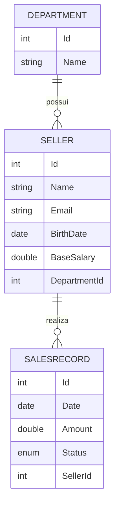

# 🛒 SalesWebMvc

Aplicação web para **gestão de vendedores, departamentos e vendas**, construída com **ASP.NET Core MVC**, **Entity Framework Core** e **MySQL**. O sistema permite cadastrar e manter vendedores e departamentos, e consultar as vendas por período, com total geral ou agrupadas por departamento.

---

## 🎥 Demonstração

https://github.com/user-attachments/assets/a9853633-4d03-4bf0-a075-c10ebf764bb6

---

## ✨ Funcionalidades

**Departamentos**
- Listar, criar, editar, detalhar e excluir departamentos.

**Vendedores**
- CRUD completo com validação de dados (nome, e-mail, data de nascimento e salário base).
- Cada vendedor pertence a um departamento, escolhido em uma lista no formulário.
- **Proteção de integridade:** não é possível excluir um vendedor que possui vendas. O sistema exibe uma mensagem de erro clara no lugar.

**Vendas**
- **Busca simples:** filtra as vendas por período (data mínima e máxima) e mostra o **total vendido** no intervalo.
- **Busca agrupada:** filtra por período e agrupa as vendas por **departamento**, com o total de cada um.
- Status da venda: `Pending`, `Billed` ou `Canceled`.

**Geral**
- Operações assíncronas (`async`/`await`) nos serviços e controllers.
- Dados de exemplo (*seed*) carregados automaticamente na primeira execução.
- Tratamento de exceções personalizadas (`NotFoundException`, `IntegrityException`, `DbConcurrencyException`).

---

## 🧰 Tecnologias

| Camada | Tecnologia |
|---|---|
| Linguagem / Framework | C#, .NET 10, ASP.NET Core MVC |
| Acesso a dados | Entity Framework Core 9 + Pomelo (provider MySQL) |
| Banco de dados | MySQL |
| Front-end | Razor Views, Bootstrap 5, jQuery Validation |
| IDE | Visual Studio |

---

## 🗂️ Modelo de dados

## 📚 O que pratiquei neste projeto

- Arquitetura **MVC** com separação em Controllers, Services e Models.
- **Entity Framework Core** com *Code First* e migrations em MySQL.
- Relacionamentos 1:N e configuração de **integridade referencial** (`DeleteBehavior.Restrict`).
- **Programação assíncrona** com `async`/`await` e `Task`.
- Validação com *Data Annotations* e tratamento de **exceções personalizadas**.
- Consultas com **LINQ**: filtros por período, `Include` e `GroupBy`.
- Utilização de **User Secrets** para o gerenciamento seguro de credenciais de banco de dados, mantendo o código limpo e protegido no versionamento.

---

## 🎓 Créditos

Projeto desenvolvido com base nos conceitos do curso **C# COMPLETO – Programação Orientada a Objetos + Projetos**, do professor **Nélio Alves** ([Educandoweb](https://educandoweb.com.br)), com adaptações e melhorias estruturais para versões recentes do .NET, EF Core e boas práticas de segurança de dados.
